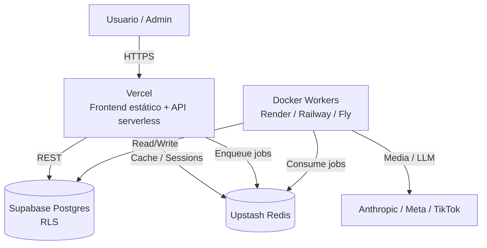
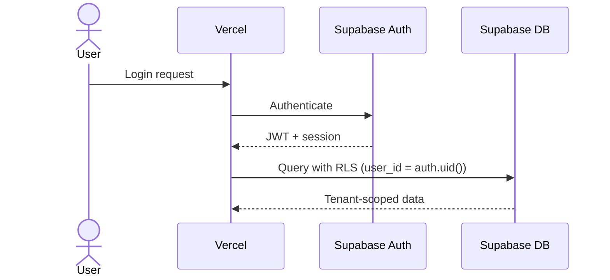
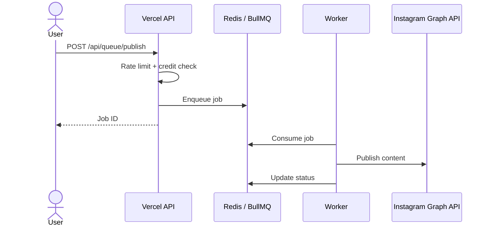

# Architecture — FeedIA

## High-level diagram

## Auth flow

## Publish flow

## Components

| Component      | Technology                  | Purpose                 |
| -------------- | --------------------------- | ----------------------- |
| Frontend       | Vanilla JS SPA              | Dashboard owner/admin   |
| API            | Vercel serverless functions | Rutas públicas y admin  |
| Auth           | Supabase Auth               | JWT + sessions          |
| Database       | Supabase Postgres           | Datos tenant            |
| Cache / Queues | Upstash Redis               | Sesiones, caché, BullMQ |
| Workers        | Docker + Node               | Procesos asíncronos     |
| Observability  | Sentry + Logtail            | Errores y logs          |
| CI/CD          | GitHub Actions              | Build, test, deploy     |
